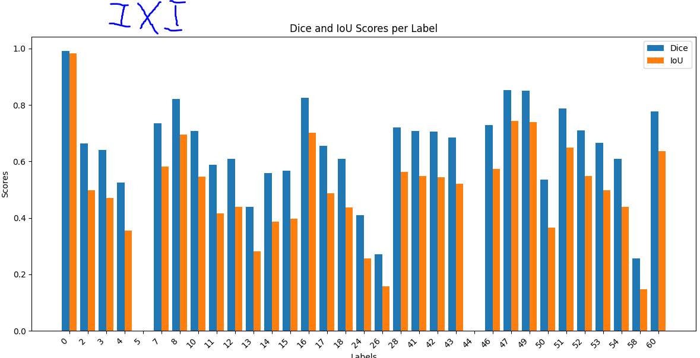

# Projet Deep Learning pour la Génération d'Images de Cerveau à partir de Prompt Text

Dans ce projet, nous continuons le travail déjà effectué par [GLucas01/projet_SIR](https://github.com/GLucas01/projet_SIR) pour construire une base de données afin d'appliquer le deep learning et générer des images de cerveaux à partir de prompts textuels. 

### Tâches principales :

1. **Correction et Enrichissement de la Base de Données** :  
   Notre objectif est d'améliorer la base de données déjà existante en y apportant des corrections et en l'enrichissant avec des données supplémentaires. Cela inclut également la préparation de captions pour des volumes d'images 3D.

2. **Comparaison des Atlas** :  
   Nous comparons deux Atlas pour déterminer s'ils sont similaires ou différents. Pour cela, nous utilisons des techniques de "recallage" direct et indirect. Les métriques utilisées pour cette comparaison sont le **Dice coefficient** et l'**Intersection over Union (IoU)**. Vous trouverez les scripts relatifs à cette tâche ci-dessous.

   Exemple de comparaison entre les deux Atlas obtenus par :
   - IXI035-IOP-0873-T2_brain_majorityInverse.nii.gz
   - 307598 IXI035-IOP-0873-T2_majorityDirect.nii.gz

   

3. **Construction de Légendes pour Volumes 3D** :  
   Nous générons des captions pour des volumes d'images 3D, une tâche essentielle pour la création de notre base de données d'entraînement. Le code utilisé pour cette tâche se trouve dans le répertoire ci-dessus.

   Exemple pour le fichier `KKI2009-1-FLAIR_brainMajorityDirect.nii` :
   - Fichier JSON associé : [lien_vers_le_fichier.json](data/readmeFILES/caption.json)

### Structure du Projet

- `scripts/` : Contient les scripts de traitement et d'analyse des données.
- `data/` : Dossier contenant les fichiers d'images et les fichiers de légendes au format JSON.
- `notebooks/` : Jupyter Notebooks pour l'analyse exploratoire des données et la visualisation des résultats.
- `results/` : Dossier pour stocker les résultats de l'analyse, y compris les images comparées et les légendes générées.
