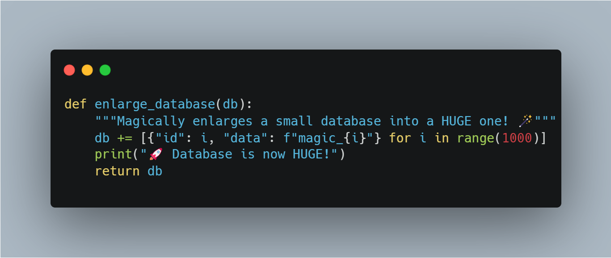

# Projet Deep Learning pour la Génération d'Images de Cerveau à partir de Prompt Text

Dans ce projet, nous continuons le travail déjà effectué par [GLucas01/projet_SIR](https://github.com/GLucas01/projet_SIR) pour construire une base de données afin d'appliquer le deep learning et générer des images de cerveaux à partir de prompts textuels. 

### Tâches principales :

##1. **Complétion des bases de données** :  

Notre objectif est de compléter notre base de données en ajoutant des images 3D et leurs segments. Cependant, nous commençons par les dossiers IBSR_IXI/seg, IBSR_OASIS/seg et IBSR_Kirby/seg. Pour cela, il est nécessaire de compléter leurs sous-dossiers reg et reg_brain, qui contiennent respectivement :

.Les images en niveaux de gris, sans boîte crânienne, des 18 images IBSR recalées sur les images des bases (IXI, OASIS, Kirby)
.Les fichiers .mat correspondant aux transformations appliquées
Nous avons choisi de commencer par ces dossiers, car ils sont indispensables à la création des nouveaux atlas.

Ensuite, nous complétons les bases de données de la modalité, qui ont une priorité plus élevée par rapport aux autres modalités. Pour cela, nous traitons les dossiers seg, reg et reg_brain des bases Kirby_OASIS et Kirby_IXI
##2. **Création des nouveaux atlas** :  

En plus des atlas obtenus par recalage inverse sur les 18 images IBSR avec leurs segments, nous créons également des atlas selon un autre processus. Nous effectuons un recalage direct des 18 images IBSR sur les images cérébrales (sans boîte crânienne) de la base que nous souhaitons segmenter. Ensuite, en utilisant les fichiers .mat de ces recalages, nous parvenons à recaler uniquement les 18 segments IBSR afin d'obtenir la segmentation des images à traiter.

Enfin, nous appliquons le script MajorityVoting.py, qui exécute le processus de majority voting sur les 18 segments d'une image, puis effectue la correction des labels. (Pour plus d’informations, veuillez consulter le README de MajorityVoting.py.)

##4.**Comparaison des deux atlas**:

Cette étape est cruciale, car elle nous permet de déterminer si les deux atlas sont similaires ou non. Pour cela, un script nommé COMPARAISON.py a été créé. Son principal objectif est de comparer deux images segmentées, c'est-à-dire les deux segments d'une même image. Il applique ensuite les métriques IoU, DICE et la distance de Hausdorff sur chaque label de ces segments. Ce processus est répété pour toutes les paires, et enfin, trois graphes sont générés, présentant la moyenne des métriques sur l’ensemble des paires. Sur ces graphes, l’axe des ordonnées représente la valeur de la métrique, tandis que l’axe des abscisses représente les labels.

#**Les résultats de comparaison pour IXI:**

#**Les résultats de comparaison pour OASIS:**

#**Les résultats de comparaison pour Kirby:**

##3. **Construction de Légendes pour Volumes 3D** :  
   Nous générons des captions pour des volumes d'images 3D, une tâche essentielle pour la création de notre base de données d'entraînement. Le code utilisé pour cette tâche se trouve dans le répertoire ci-dessus.

   Exemple pour le fichier `KKI2009-1-FLAIR_brainMajorityDirect.nii` :
   - Fichier JSON associé : [lien_vers_le_fichier.json](data/readmeFILES/caption.json)

### Structure du Projet

- `scripts/` : Contient les scripts de traitement et d'analyse des données.
  

