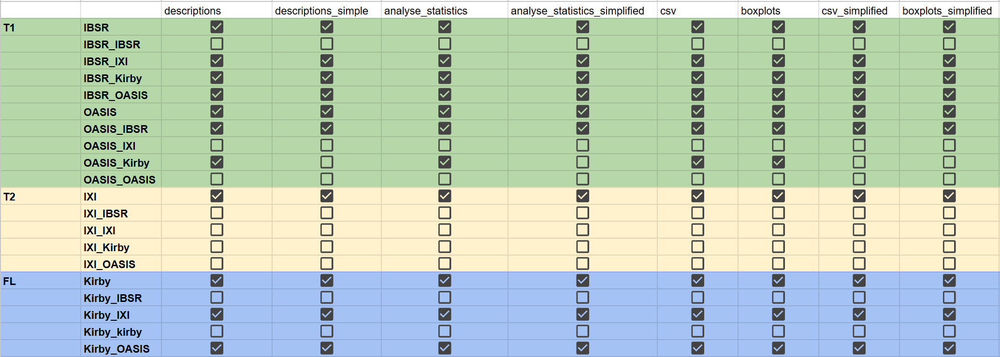

# Projet Deep Learning pour la Génération d'Images de Cerveau à partir de Prompt Text


Dans ce projet, nous continuons le travail déjà effectué par [GLucas01/projet_SIR](https://github.com/GLucas01/projet_SIR) pour construire une base de données afin d'appliquer le deep learning et générer des images de cerveaux à partir de prompts textuels. 

## Structure de la base de données (sur disque dure)
### Nouvelle Arborescence utilisée
```
SIR/
├── FL/
│   ├── Kirby/
│   │   ├── brain/
│   │   ├── NG/
│   │   ├── seg/
│   │   ├── seg_direct/
│   │   ├── descriptions/
│   │   ├── descriptions_simple/
│   │   ├── captions_3d_simple/
│   │   ├── captions_3d/
│   │   ├── analyse_statistics/
│   │   │   ├── csv/
│   │   │   ├── boxplots/
│   │   ├── analyse_statistics_simplified/
│   │   │   ├── csv/
│   │   │   ├── boxplots/
│   ├── Kirby_OASIS/
│   │   ├── reg/
│   │   ├── reg_brain/
│   │   ├── seg/
│   │   ├── descriptions/
│   │   ├── descriptions_simple/
│   │   ├── captions_3d_simple/
│   │   ├── captions_3d/
│   │   ├── analyse_statistics/
│   │   │   ├── csv/
│   │   │   ├── boxplots/
│   │   ├── analyse_statistics_simplified/
│   │   │   ├── csv/
│   │   │   ├── boxplots/
```

- `descriptions` : contient les descriptions des images avec **ANATOMIE_IBSR.csv**  
- `descriptions_simple` : contient les descriptions des images avec **simplified_IBSR.csv**  
- `captions_3d` : contient les captions générés avec **captions_generator_advanced.py**  
- `captions_3d_simple` : contient les captions générés avec **simple_captions.py**  
- `analyse_statistics/` : Statistical analysis outputs.  
    - `csv/` : Contains statistical result files in CSV format.  
    - `boxplots/` : Box plot visualizations of the statistical data.  
- `analyse_statistics_simplified/` : Simplified version of the statistical analysis.  
    - `csv/` : Contains simplified statistical result files in CSV format.  
    - `boxplots/` : Box plot visualizations of the simplified statistical data.
 
# Complétion du disque dur
## Tâches réalisées :

   1. **Complétion des bases de données** :  

Notre objectif est de compléter notre base de données en ajoutant des images 3D et leurs segments. Cependant, nous commençons par les dossiers IBSR_IXI/seg, IBSR_OASIS/seg et IBSR_Kirby/seg. Pour cela, il est nécessaire de compléter leurs sous-dossiers reg et reg_brain, qui contiennent respectivement :

.Les images en niveaux de gris, sans boîte crânienne, des 18 images IBSR recalées sur les images des bases (IXI, OASIS, Kirby)
.Les fichiers .mat correspondant aux transformations appliquées
Nous avons choisi de commencer par ces dossiers, car ils sont indispensables à la création des nouveaux atlas.

Ensuite, nous complétons les bases de données de la modalité, qui ont une priorité plus élevée par rapport aux autres modalités. Pour cela, nous traitons les dossiers seg, reg et reg_brain des bases Kirby_OASIS et Kirby_IXI
  
   2. **Création des nouveaux atlas** :  

En plus des atlas obtenus par recalage inverse sur les 18 images IBSR avec leurs segments, nous créons également des atlas selon un autre processus. Nous effectuons un recalage direct des 18 images IBSR sur les images cérébrales (sans boîte crânienne) de la base que nous souhaitons segmenter. Ensuite, en utilisant les fichiers .mat de ces recalages, nous parvenons à recaler uniquement les 18 segments IBSR afin d'obtenir la segmentation des images à traiter.


Enfin, nous appliquons le script MajorityVoting.py, qui exécute le processus de majority voting sur les 18 segments d'une image, puis effectue la correction des labels. (Pour plus d’informations, veuillez consulter le README de MajorityVoting.py.).Pour le chemin du nouveau atlas, il se trouve dans le dossier de la base de données /seg_direct (IXI/seg_direct).    


   3. **Comparaison des deux atlas**:

Cette étape est cruciale, car elle nous permet de déterminer si les deux atlas sont similaires ou non. Pour cela, un script nommé COMPARAISON.py a été créé. Son principal objectif est de comparer deux images segmentées, c'est-à-dire les deux segments d'une même image. Il applique ensuite les métriques IoU, DICE et la distance de Hausdorff sur chaque label de ces segments. Ce processus est répété pour toutes les paires, et enfin, trois graphes sont générés, présentant la moyenne des métriques sur l’ensemble des paires. Sur ces graphes, l’axe des ordonnées représente la valeur de la métrique, tandis que l’axe des abscisses représente les labels.

 **Les résultats de comparaison pour IXI:**


 **Les résultats de comparaison pour OASIS:**


 **Les résultats de comparaison pour Kirby:**


   
# Construction de Légendes pour Volumes 3D

## Description du processus

Cette section explique comment utiliser les codes pour générer des légendes (captions) pour les volumes 3D.

### 1. Générer les Descriptions

Pour commencer, il est essentiel d’avoir des descriptions. Pour cela, utilisez le script `description_generator.py` avec la commande suivante :

```bash
python script.py "SIR/statistiques/IBSR/labels.csv" "SIR/FL/Kirby/brain" "SIR/FL/Kirby/descriptions"
```

Les résultats seront enregistrés dans le dossier `descriptions`. Ces fichiers pourront ensuite être utilisés pour générer les légendes avec le script `caption_generator_advanced.py` comme suit :

```bash
python caption_generator_advanced.py data_kirby descriptions_3D ./metafolder/ captions_test --var 5
```

**Attention** : Les résultats générés avec cette méthode ne sont pas parfaits et ne répondent pas entièrement aux exigences des légendes. Il est donc préférable d’utiliser le script `simple_captions.py` pour obtenir des résultats de meilleure qualité.

### 2. Générer des Descriptions Simples

Avant d'utiliser `simple_captions.py`, il est nécessaire de créer des descriptions simples. Utilisez le script `simple_descriptions.py` pour cela. Vous devrez seulement ajuster les chemins au début du code pour qu’ils pointent vers le dossier `descriptions`.

Une fois que les nouveaux fichiers CSV sont générés, vous pouvez ensuite exécuter le script `simple_captions.py` pour créer des légendes plus détaillées et adaptées. Voici un exemple de commande :

```bash
python simple_captions.py D:\SIR\T2\IXI\seg D:\SIR\T2\IXI\descriptions_simple .\metafolder\ D:\SIR\T2\IXI\captions_3d_simple\captions_exhaustive
```


### 3. Dossier des Métadonnées

Enfin, veillez à ne pas oublier d’inclure le dossier des métadonnées dans vos répertoires de travail.
### 4. Supprimer les liens logiques à la fin

si les liens logiques ne sont pas souhaitable dans les captions, utiliser le code `"delete_connectors.py"` Sur les captions générés. il faut seulemnt ajouter le lien de dossier captions dans `le chemin`:
```python
dossier_json = r"D:\SIR\T1\IBSR_OASIS\captions_3d_simple\captions_var_10"
```


---

### 5. Modalite_speed.py

Ce script a pour objectif de corriger rapidement certaines informations dans des fichiers JSON générés précédemment. Plus précisément, il parcourt un répertoire contenant plusieurs sous-dossiers (par exemple, *captions_exhaustive*, *captions_selection*, *captions_size_10* et *captions_var_10*) et remplace dans le champ « captions » une modalité erronée par la modalité correcte. Pour optimiser la vitesse d’exécution, le script n’utilise pas d’arguments en ligne de commande ; tous les chemins sont définis directement dans le code. De plus, il exploite le **multithreading** pour traiter simultanément les différents sous-dossiers. Voici les points clés :

- **Variables globales** : Deux variables, `wrong_info` et `right_info`, sont définies pour représenter respectivement la modalité incorrecte ("T1") et la modalité correcte ("FLAIR").
- **Fonction `replace_none_in_json`** : Elle parcourt chaque fichier JSON d’un dossier, remplace dans le tableau « captions » toutes les occurrences de la modalité erronée par la bonne modalité, puis sauvegarde le fichier modifié.
- **Fonction `process_directory`** : Elle traite chacun des sous-dossiers spécifiés en appelant la fonction de remplacement.
- **Utilisation de threads** : Le script crée 4 threads, chacun chargé de traiter l’un des sous-dossiers, ce qui permet de paralléliser le travail et d’accélérer le traitement global.

Ce script permet ainsi de remplir efficacement plusieurs bibliothèques en peu de temps, en garantissant que tous les fichiers soient modifiés rapidement.

---

### 6. caption_generator_speed.py

Ce script est un générateur de légendes pour des images médicales, conçu en priorité pour la performance. Afin de maximiser l’efficacité, les chemins d’accès aux dossiers (images, descriptions CSV, métadonnées et dossier de sortie) sont directement codés, et le script produit simultanément quatre fichiers de sortie pour chaque image. Les quatre sorties correspondent aux approches suivantes :

1. **captions_exhaustive** : Génération de légendes pour toutes les structures détectées, sans filtrage.
2. **captions_selection** : Application d’un filtre fixe basé sur une liste d’ID de structures prédéfinie.
3. **captions_size_10** : Conservation uniquement des 10 structures les plus volumineuses.
4. **captions_var_10** : Filtrage des structures en fonction de la variance de leur volume, à partir d’une liste pré-calculée pour éviter des recalculs coûteux.

Pour augmenter encore la vitesse de traitement, le script utilise le **multiprocessing** avec 8 processus, ce qui permet de traiter plusieurs images en parallèle. Voici les points essentiels du code :

- **Pré-calcul de la variance** : La fonction `calculate_top_variance_structures` parcourt tous les fichiers CSV pour calculer la variance des volumes de chaque structure et retourne une liste d’IDs correspondant aux structures avec la plus grande variance. Ce calcul est effectué une seule fois dans le processus principal, et le résultat est ensuite transmis à tous les processus de traitement.
- **Fonction `generate_human_like_caption`** : Elle génère les légendes pour une image en combinant les données des fichiers CSV de description et des métadonnées. Selon les paramètres fournis (sélection, taille, variance), elle applique différents filtres pour constituer la légende finale.
- **Traitement en parallèle** : La fonction `process_folder` parcourt le dossier d’images et utilise le module `multiprocessing.Pool` (avec 8 processus) pour lancer simultanément le traitement de plusieurs fichiers via la fonction `process_single_file`.
- **Production de 4 fichiers par image** : Pour chaque image, quatre versions de légendes sont générées et enregistrées dans des sous-dossiers dédiés.

Ce script a été adapté de la version précédente. Grâce à l’utilisation conjointe du multithreading et du multiprocessing, l’ensemble du traitement (couvrant neuf bibliothèques différentes telles que IBSR, IBSR_IXI, IBSR_Kirby, IBSR_OASIS, OASIS, IXI, Kirby, Kirby_IXI, Kirby_OASIS) a pu être achevé avant 17 heures. Les résultats seront ensuite remis à des camarades pour vérification et, si possible, un rendez-vous est envisagé demain pour finaliser la présentation.

--- 

# Analyse statistique pour les bases de données

## Description
Cette partie consiste à analyser statistiquement les structures cérébrales pour chaque atlas à partir des fichiers CSV associés aux images au format nii.gz, qui contiennent des informations telles que l’ID du sujet, le label anatomique, le volume et le ratio volumique, en regroupant les données en six catégories (Male, Female, Minor, Senior, Adult, Overall) pour chaque atlas.

Sur la base de ces statistiques, des boîtes à moustaches ont été générées pour visualiser les distributions des volumes, fournissant ainsi des informations clés pour la création de captions 3D, notamment en identifiant les structures qui présentent les variations les plus importantes. Nous détaillerons ce point plus tard. 
## Génération des Statistiques en Fichiers JSON

### 1. Générer les statistiques d'information en fichiers JSON

Avec l'aide des fichiers situés dans les dossiers `description`, `Anatomie_IBSR.csv` et `atlas_infos` (dans le metafolder), pour chaque base de données, lancez le script `statistiques_cerveux.py` avec la commande suivante (sous Windows):

```bash
python statistiques_cerveux.py path_to_inputfolder
```

**Exemple de lancement:**

```bash
python .\statistiques_cerveux.py .\SIR\FL\Kirby\descriptions\
```

Pour la sortie, les 6 fichiers JSON sont enregistrés dans le nouveau répertoire créé `analyse_statistics`:

- `Male_statistics.json`
- `Female_statistics.json`
- `Minor_statistics.json`
- `Adult_statistics.json`
- `Senior_statistics.json`
- `All_statistics.json`

---

### 2. Générer les statistiques d'information en fichiers JSON avec les informations structurelles sur la version simplifiée

Cette partie est similaire à l'étape précédente. La différence est que l'on utilise les informations de structure simplifiée présentes dans `simplified_IBSR.csv`. Avec l'aide des fichiers situés dans les dossiers `description_simple`, `simplified_IBSR.csv` et `atlas_infos` (dans le metafolder), pour chaque base de données, lancez le script `statistiques_cerveux_simplified.py` avec la commande suivante (sous Windows):

```bash
python statistiques_cerveux_simplified.py path_to_inputfolder
```

**Exemple de lancement:**

```bash
python .\statistiques_cerveux_simplified.py .\SIR\FL\Kirby\descriptions_simple\
```

Pour la sortie, les 6 fichiers JSON sont enregistrés dans le nouveau répertoire créé `analyse_statistics_simplified`:

- `Male_statistics.json`
- `Female_statistics.json`
- `Minor_statistics.json`
- `Adult_statistics.json`
- `Senior_statistics.json`
- `All_statistics.json`

## Convertisseur JSON en CSV 
### Description

Ce programme Python `convertisseur.py` convertit les fichiers de données d'analyse statistique du cerveau au format JSON en fichiers CSV. Chaque fichier JSON contenant des informations sur les statistiques de différentes régions du cerveau est traité et converti en un fichier CSV. Ce programme est conçu pour être utilisé sur un dossier contenant plusieurs fichiers JSON.

### Prérequis

- Les fichiers JSON d'analyse statistique doivent être présents dans le dossier d'entrée.

### Utilisation

Sur un système Windows, vous pouvez exécuter le programme avec la commande suivante :

```bash
python .\convertisseur.py path_input_folder
```

**Exemple d'exécution :**

```bash
python .\convertisseur.py .\SIR\FL\Kirby\analyse_statistcs
```

Les fichiers CSV générés seront placés dans le dossier `csv` qui se trouve dans le dossier d'entrée.

## Boîte à Moustache - Génération de Boxplots

### Description

Ce programme Python `boite_a_moustache.py` génère des boîtes à moustache à partir des données contenues dans des fichiers JSON du dossier concernant les analyses statistiques. Chaque boxplot représente la distribution des volumes de données, avec les valeurs minimales, les quartiles, et les éventuels points aberrants.

### Utilisation
Sur un système Windows, vous pouvez exécuter le programme avec la commande suivante :

```bash
python .\boite_a_moustache.py path_input_folder
```

**Exemple d'exécution :**

```bash
python .\boite_a_moustache.py .\SIR\FL\Kirby\analyse_statistcs
```

Les images générées représentent chaque structure présente dans chaque fichier JSON et sont enregistrées dans un nouveau dossier `boxplots` situé soit dans le dossier d'entrée 


## Bilan et Perspectives

Cette table montre l'état d'avancement actuel du projet. Plus de la moitié des bases de données ont été traitées. Pour l'avenir, dès que les informations `desccriptions` et `descriptions_simple` seront générées, nous pourrons rapidement compléter l'analyse des bases de données.




